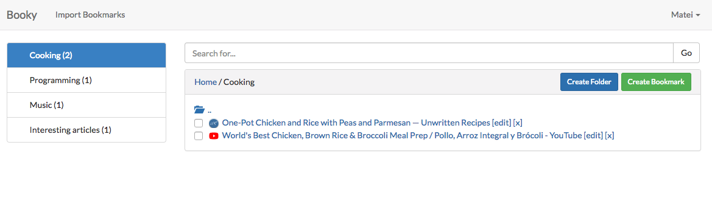

# Booky

A bookmark manager.

## Description

### Usual process

1. You register an account
1. You can import your Chrome bookmarks
1. Continue adding / modifying bookmarks from any device

### Screenshot



### Notes

- You can reimport your Chrome bookmarks as many times as you want, the
import script will only add each unique bookmark once
- You only need to specify the page url, the application with automatically
fetch the title and favicon


## Installation

```
git clone git@github.com:mateicarpen/booky.git
cd booky

composer install

cp .env.example .env
php artisan key:generate
# modify the .env file to suit your needs (you will need database details)

php artisan migrate

npm install
```

## Technologies used

- Laravel 5.5
- Vue.js 2.5